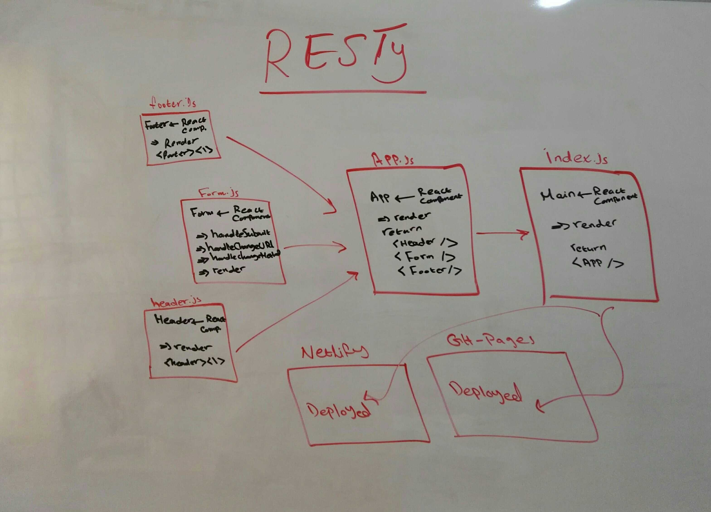

# RESTy
# LAB 28 - Props and State

___
### Author: Bushra Bilal.

### Resources: [PR Link]()
___

**RESTy Phase 3:** Connect RESTy with APIs, running live requests

## Phase 3 Requirements

In phase 3, we will be connecting RESTy to live APIs, fetching and displaying remote data.   
Our primary focus will be to service GET requests.

The following user/developer stories detail the major functionality for this phase of the project.

- As a user, I want to enter the URL to an API and issue a GET request so that I can retrieve it’s data
- As a user, I want to see the results returned from an API request in my browser in a readable format

## Application Flow

- User enters an API URL
- Chooses a REST Method
- Clicks the “Go” button
- Application fetches data from the URL - given, with the method specified
- Displays the response headers and - results separately
- Both headers and results should be “pretty printed” JSON

## Setup

- clone the repo
- run `npm i` command to install the dependencies
- run `npm start` to start the app in the browser

## Deployment Links:

- [GH-Pages](https://bushra-401-advanced-javascript.github.io/resty-deployment/)

- [Neflify](https://sleepy-pasteur-1821f7.netlify.app/)

## UML

